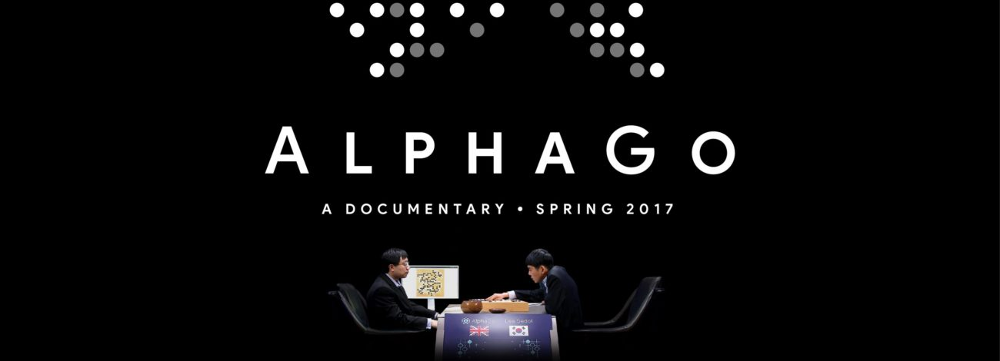

# Artificial Intelligence
*AI is the discipline that deals with uncertainty and manages it in decision making*
**Peter Norvig**

AI program is called **Intelligent Agent** just like **AlphaGo**. You can learn more about **AlphaGo** by watching the documentary and/or reading the paper

- [Documentary](https://www.alphagomovie.com/)
- [Paper](https://storage.googleapis.com/deepmind-media/alphago/AlphaGoNaturePaper.pdf)

This repository is built to showcase completed classroom projects of Artificial Intelligence and Specializations Nanodegree offered by [Udacity](https://www.udacity.com/)

This README is broken down into the following sections:

- [Sudoku](#sudoku)
- [Isolation](#isolation)
- [Planning](#planning)
- [Recognizer](#recognizer)
- [Computer Vision Capstone](#computer-vision-capstone)
- [Natural Language Processing Capstone](#natural-language-processing-capstone)
- [Voice User Interface Capstone](#voice-user-interface-capstone)

## Sudoku ##
In this project  we practiced two very important concepts of artificial intelligence, **constraint propagation** and **search**. We created  an **AI agent** that will solve any Sudoku puzzle. In this project, The goals are to implement the **naked twins** function, and write an AI agent that will solve the **Diagonal Sudoku** game.The algorithm fully used are based from the great [blogpost](http://norvig.com/sudoku.html) of Peter Norvig. 

You can find more information about the implementation steps of this project on the project's own [README](/Sudoku/README.md) file. Also, You can visit the project's original [repository](https://github.com/udacity/aind-sudoku) for further information.

**My Solution**
- [Solution](Sudoku/solution.py)

## Isolation ##
In this project, we implemented 

- **minimax** search
- minimax search with **alpha-beta pruning**
- **iterative deepening** search
- our own best position evaluation heuristic
- our own alternate position evaluation heuristic
- our own alternate position evaluation heuristic

In the second part of this project we read a seminal paper in the field of Game-Playing and wrote a simple one page summary on it. In my case I read **AlphaGo** paper.

You can find more information about the implementation steps of this project on the project's own [README](Isolation/README.md) file. Also, You can visit the project's original [repository](https://github.com/udacity/AIND-Isolation) for further information.

**My Solution**
- [Solution](Isolation/game_agent.py)
- [Heuristic Analysis](Isolation/heuristic_analysis.pdf)
- [Research Review](Isolation/research_review.pdf)
## Planning ##
In this project, you will define a group of problems in classical PDDL (Planning Domain Definition Language) for the air cargo domain discussed in the lectures. You will then set up the problems for search, experiment with various automatically generated heuristics, including planning graph heuristics, to solve the problems, and then provide an analysis of the results. Additionally, you will write a short research review paper on the historical development of planning techniques and their use in artificial intelligence.

You can find more information about the implementation steps of this project on the project's own [README](Planning/README.md) file. Also, You can visit the project's original [repository](https://github.com/udacity/AIND-Planning) for further information.

**My Solution**
- [Air Cargo Solution](Planning/my_air_cargo_problems.py)
- [Planning Graph Solution](Planning/my_planning_graph.py)
- [Heuristic Analysis](Planning/heuristic_analysis.pdf)
- [Research Review](Planning/research_review.pdf)
## Recognizer ##
In this project, you will build a system that can recognize words communicated using the American Sign Language (ASL). You will be provided a preprocessed dataset of tracked hand and nose positions extracted from video. Your goal would be to train a set of Hidden Markov Models (HMMs) using part of this dataset to try and identify individual words from test sequences.

As an optional challenge, you can incorporate Statistical Language Models (SLMs) that capture the conditional probability of particular sequences of words occurring. This will help you improve the recognition accuracy of your system.
## Computer Vision Capstone ##
Welcome to the Computer Vision capstone project in the AI Nanodegree program! In this project, you’ll combine your knowledge of computer vision techniques and deep learning to build and end-to-end facial keypoint recognition system. Facial keypoints include points around the eyes, nose, and mouth on any face and are used in many applications, from facial tracking to emotion recognition. Your completed code should be able to take in any image containing faces and identify the location of each face and their facial keypoints, as shown below.

Project Components
The project will be broken up into a few main parts in one Python notebook:

Part 1: Investigating OpenCV, pre-processing, and face detection

Part 2 : Training a Convolutional Neural Network (CNN) to detect facial keypoints

Part 3 : Putting parts 1 and 2 together to identify facial keypoints on any image!

You'll also be given optional exercises that allow you to extend this project so that it works on video and allows you to implement fun face filters in real-time!
## Natural Language Processing Capstone ##
Machine translation is a popular topic in research with new papers coming out every year. Over the years of research, different methods were created, like rule-based, statistical, and example-based machine translation. With all this effort, it’s still an unsolved problem. However, neural networks have made a large leap forward in machine translation.

In this notebook, you will build a deep neural network that functions as part of an end-to-end machine translation pipeline. Your completed pipeline will accept English text as input and return the French translation.
## Voice User Interface Capstone ##
In this notebook, you will build a deep neural network that functions as part of an end-to-end automatic speech recognition (ASR) pipeline!

We begin by investigating the LibriSpeech dataset that will be used to train and evaluate your models. Your algorithm will first convert any raw audio to feature representations that are commonly used for ASR. You will then move on to building neural networks that can map these audio features to transcribed text. After learning about the basic types of layers that are often used for deep learning-based approaches to ASR, you will engage in your own investigations by creating and testing your own state-of-the-art models. Throughout the notebook, we provide recommended research papers for additional reading and links to GitHub repositories with interesting implementations.